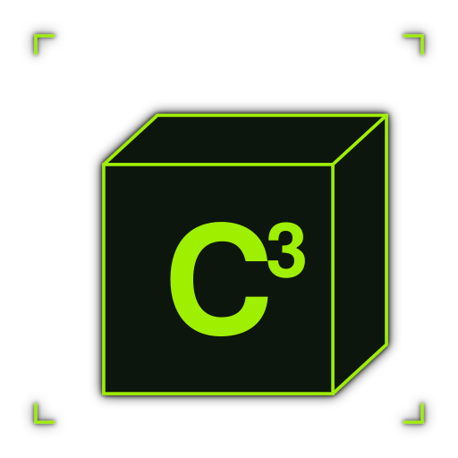
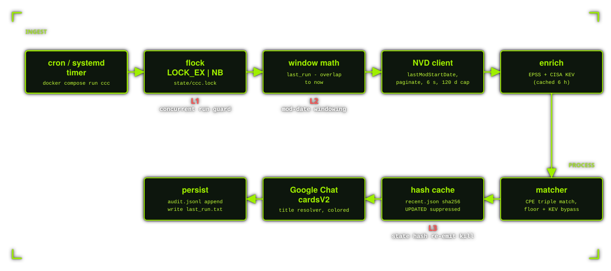

<p align="center">
  
</p>

# C³ - Continuous CVE Coverage

**Get CVE alerts for the products you run.**

Polls NVD on a schedule. Matches CVEs against your product list by CPE.
Alerts Google Chat with severity, KEV status, EPSS score, and a curated title.
Never alerts twice for the same CVE-state.

- Repo: `ccc` · Brand: `c³`
- Python 3.11+, 4 hash-pinned dependencies (multi-Python ABI in [`requirements.lock`](requirements.lock))
- Runs in Docker (recommended) or local venv via `./setup.sh --local`
- Six flat state files, no database (see [State files](#state-files))
- Dedup proven by 10 unit tests in [`tests/test_dedup.py`](tests/test_dedup.py)
- ~1800 LOC across [10 modules](ccc/)

---

## Quick start

```bash
git clone https://github.com/rvzsec/ccc.git && cd ccc
./setup.sh                     # detects docker, builds image, resolves CPEs
$EDITOR config/config.yaml     # paste your Google Chat webhook URL
```

That's it. To run:

```bash
docker compose run --rm ccc run
```

To schedule it hourly via systemd, see [Scheduling](#scheduling) below.

`./setup.sh` auto-detects docker (recommended). Pass `--local` if you want a `pip install` into a venv instead of docker (still hash-pinned).

---

## What an alert looks like

Single Google Chat card per CVE. Severity word colored inline.
KEV value colored red when active.

```
CVE-2021-44228: Apache Log4j2 Remote Code Execution Vulnerability

Product:   Apache Log4j
CVSS:      10.0 Critical / CVSS:3.1/AV:N/AC:L/PR:N/UI:N/S:C/C:H/I:H/A:H
Status:    Modified
EPSS:      97.6%
KEV:       Yes (CISA actively exploited)
Advisory:  https://nvd.nist.gov/vuln/detail/CVE-2021-44228
```

**Title resolution** (zero extra HTTP calls):

1. **CISA KEV** `vulnerabilityName` if the CVE is on the KEV list
2. **CWE name + product** if NVD assigned a known CWE (e.g. `Deserialization of Untrusted Data in Apache Tomcat`)
3. **First sentence of the NVD description** as fallback

KEV-curated names are cached locally for 6 h. CWEs come from the NVD response
itself, so no extra request.

---

## Configuration

### `config/config.yaml`

See [`config/config.example.yaml`](config/config.example.yaml). Knobs you care about:

| Field | Default | Effect |
|---|---|---|
| `nvd_api_key` | `""` | NVD key, 50 req/30 s with, 5 req/30 s without |
| `severity_floor` | `high` | Drop CVSS below this. KEV bypasses unless disabled. |
| `kev_bypass_floor` | `true` | KEV CVEs alert regardless of severity floor |
| `epss_threshold` | `0.5` | EPSS value that triggers the priority highlight (display only) |
| `alert_on_update` | `false` | Re-alert when an already-seen CVE's hash changes |
| `poll_overlap_minutes` | `10` | Window overlap to absorb NVD eventual consistency |
| `max_lookback_hours` | `24` | Cap on lookback when state is stale or missing |
| `google_chat_webhook` | `""` | Incoming Webhook URL from a Chat space |
| `state_dir` | `/state` | Container path for state files |
| `products_file` | `/config/products.yaml` | Container path for products list |

### `config/products.yaml`

Two forms — plain names (auto-resolved to CPE) or dict overrides (explicit CPE).
Mix freely.

**Plain names** (recommended). ccc resolves each name to the canonical CPE via
NVD's CPE Dictionary API on first run and caches it in `state/cpe_cache.json`
forever. No CPE syntax to learn.

```yaml
products:
  - jenkins
  - apache log4j
  - fortinet fortios
  - linux kernel
  - openssl
  - nginx
```

**Dict overrides**. Use when (a) the vendor has multiple product lines under
the same name (e.g. `vmware vcenter` ambiguously matches vcenter_server vs
vcenter_operations vs vcenter_orchestrator), (b) NVD has no CPE for the name
you used, or (c) you want a strict version pin. Find CPEs at
<https://nvd.nist.gov/products/cpe/search>.

```yaml
products:
  - jenkins                                                         # plain
  - name: "VMware vCenter Server"
    cpe:  "cpe:2.3:a:vmware:vcenter_server:*"                       # override
  - name: "Apache Log4j 2.14.1 only"
    cpe:  "cpe:2.3:a:apache:log4j:2.14.1:*:*:*:*:*:*:*"              # version pin
```

Matches are by `(part, vendor, product)` triple, case-insensitive. Wildcard
versions match anything; pinned versions require exact CPE prefix.

**First-run latency:** ccc waits 6 s between NVD CPE lookups (NVD's
recommended pacing). 10 plain names cold-cache = ~60 s. With an `nvd_api_key`
it's ~12 s. Subsequent runs are instant (cache hits).

Run `docker compose run --rm ccc validate` (or `.venv/bin/ccc validate` in
local mode) to resolve everything and verify before scheduling.

### Google Chat webhook

In a Chat space: **Apps & integrations → Webhooks → Add webhook**.
Use the **Incoming Webhook URL**, not an Apps Script URL.

---

## Architecture

<p align="center">
  
</p>

### Dedup, three layers

| Layer | Defends against | Mechanism |
|---|---|---|
| L1 | Concurrent runs (cron overrun, manual re-run, systemd flap, double cron entry) | `fcntl.flock(LOCK_EX \| LOCK_NB)` on `state/ccc.lock`. Second invocation exits 0 silently. |
| L2 | NVD republishing unchanged CVEs | Query `lastModStartDate = last_run - overlap`. Only CVEs NVD actually touched appear in the window. |
| L3 | The overlap window re-emitting the same CVE-state | `recent.json` stores `sha256(cve_id + cvss + kev + epss_bucket + vuln_status)`. Skip if hash unchanged; `[UPDATED]` if changed (suppressed unless `alert_on_update: true`). |

Verified by [`tests/test_dedup.py`](tests/test_dedup.py):

- 24 hourly ticks → exactly the right alerts, zero dupes.
- Cron-overrun scenario (two ticks 30 min apart, same window) → second tick alerts zero.
- Stale state → window correctly capped at `max_lookback_hours`.

### Signal rules

A CVE alerts only if ALL true:

1. It has a `vulnerable: true` CPE in [`products.yaml`](config/products.example.yaml) matched by `(part, vendor, product)`.
2. `vulnStatus` is not `Rejected`.
3. Either CVSS ≥ `severity_floor`, **or** CVE is on CISA KEV and `kev_bypass_floor: true`.
4. Hash differs from any prior entry in `recent.json`. UPDATED variants are dropped unless `alert_on_update: true`.

`alert_on_update: false` is the default. Most teams do not act on NVD revising
a CVE you already triaged. Flip to `true` if your workflow wants
`[UPDATED]` cards on material changes.

---

## State files

Under the `ccc-state` Docker volume (`/state` inside the container) — or
`./state/` in local mode. All flat files, no database, bounded growth.

```
state/
├── ccc.lock         # flock fd, 0 bytes - L1 dedup
├── last_run.txt     # one ISO-8601 UTC timestamp - written on full success
├── recent.json      # {cve_id: {hash, seen_at}}, rotates entries > 14 days
├── audit.jsonl      # append-only log; rotates at 10 MB, keeps 5 backups
├── kev.json         # CISA KEV cache, refreshed every 6 h (~130 KB)
└── cpe_cache.json   # resolved product-name -> CPE lookup, written once per product
```

**Total state size** in typical use: ~200 KB. Hard cap: ~60 MB once
`audit.jsonl` reaches rotation. No file grows unbounded.

Delete any of them and the worst case is one bonus alert per CVE.
No data loss, no rebuild needed.

Inspect with `make state` or `make logs`.

---

## Supply-chain hardening

Four direct dependencies, all top-tier maintainers, all hash-pinned:

| Dep | Version | Maintainer |
|---|---|---|
| `httpx` | 0.27.2 | Encode (Tom Christie, Starlette / FastAPI) |
| `pydantic` | 2.9.2 | Pydantic team |
| `pyyaml` | 6.0.2 | Ingy döt Net + Matt Davis |
| `click` | 8.1.7 | Pallets (Armin Ronacher, Flask / Jinja2) |

Full dependency closure (direct + transitive) pinned in [`requirements.lock`](requirements.lock).

**Do not trust the lockfile until you audit it.** Run:

```bash
make audit
```

This pulls every pinned wheel from PyPI inside a clean container and compares
SHA256 against `requirements.lock`. Any mismatch aborts loud.

Other defenses:

- `pip install --require-hashes` inside the build container. Tampered wheels fail install, not runtime.
- Container runs as non-root (`uid=1000`), read-only rootfs, all caps dropped, `no-new-privileges`.
- State and config mounted at runtime. Nothing baked into the image.
- `yaml.safe_load` only. No `yaml.load`, no arbitrary Python object construction.
- Image base: `python:3.13-slim-bookworm` (Debian, minimal).

---

## Scheduling

### systemd timer (recommended)

```bash
sudo cp systemd/ccc.service systemd/ccc.timer /etc/systemd/system/
sudo sed -i "s|/opt/ccc|$(pwd)|" /etc/systemd/system/ccc.service
sudo systemctl daemon-reload
sudo systemctl enable --now ccc.timer
sudo systemctl list-timers ccc.timer
```

`OnCalendar=hourly` with `RandomizedDelaySec=300` so deployments don't all hit
NVD at `:00`. `Persistent=true` catches up on missed runs after host reboot.

### cron

```cron
15 * * * * cd /opt/ccc && /usr/bin/docker compose run --rm ccc run
```

Either way, the `flock` guard prevents overlap and the time math handles
missed runs up to `max_lookback_hours`.

---

## Commands

The four commands you'll actually use:

```bash
docker compose run --rm ccc validate       # check config + product CPEs
docker compose run --rm ccc test-webhook   # send a test message to your Chat space
docker compose run --rm ccc run            # one poll cycle (this is what cron calls)
docker compose run --rm ccc run --dry-run  # poll + print alerts, send nothing
```

In local mode, replace `docker compose run --rm ccc` with `.venv/bin/ccc`.

### CLI exit codes

| Code | Meaning |
|---|---|
| `0` | Success, or another instance is running (silent) |
| `1` | Config / usage error |
| `2` | NVD API failure - `last_run` NOT advanced, next run retries the window |
| `3` | Webhook failure - `last_run` NOT advanced, the failing CVE is rolled back so it re-fires |

---

## Edge cases worth knowing

- **NVD assignment lag.** A CVE may be reserved at MITRE for days before NVD enriches it with CPEs. Without CPEs the matcher cannot link it to your product. Most major CVEs (Apache, Fortinet, Cisco) get CPEs within hours; some take days. There is no fix at this layer.
- **`AWAITING_ANALYSIS` status.** NVD published the CVE but hasn't scored CVSS yet. The gate drops these UNLESS they are KEV-listed. `CVSS: N/A` is noise; KEV-bypass guarantees you still catch actively-exploited ones immediately.
- **No CPE on the CVE.** Some CVEs never get CPEs (junk submissions, hardware-only bugs). The matcher cannot see them. Keyword fallback is intentionally not implemented to keep signal clean.

---

## Project layout

```
ccc/
├── pyproject.toml            # 4 hash-pinned deps + project metadata
├── requirements.lock         # full transitive closure, multi-Python ABI hashes
├── README.md                 # this file
├── LICENSE                   # MIT (Zyenra Security)
├── setup.sh                  # auto-detect + install (docker mode or --local mode)
├── Dockerfile                # 2-stage, --require-hashes, non-root uid=1000
├── docker-compose.yml        # 3 services: ccc, test, audit
├── Makefile                  # contributor targets (build / test / audit / shell / clean)
├── config/
│   ├── config.example.yaml   # documented knobs
│   └── products.example.yaml # plain names + dict-override forms
├── ccc/                      # 10 modules, ~1800 LOC
│   ├── cli.py                # click CLI: run, validate, test-webhook, version
│   ├── config.py             # pydantic v2 models, CPE 2.3 validator
│   ├── lock.py               # fcntl.flock guard - L1 dedup
│   ├── state.py              # last_run.txt + recent.json + audit.jsonl rotation - L2/L3 dedup
│   ├── nvd.py                # NVD 2.0 client, ISO-8601-ms, 120 d cap, 6 s pacing, 429 retry
│   ├── enrich.py             # EPSS batch JSON + CISA KEV cached 6 h (with stale fallback)
│   ├── matcher.py            # CPE triple matching, severity floor + KEV bypass
│   ├── notifier.py           # Google Chat cardsV2, title resolver, colored severity
│   └── resolver.py           # NVD CPE Dictionary lookup, on-disk cache, ambiguity handling
├── tests/
│   └── test_dedup.py         # 10 tests: dedup, CPE case, HTML escape, dry-run, window math
├── systemd/
│   ├── ccc.service           # Type=oneshot
│   └── ccc.timer             # hourly + RandomizedDelaySec=300 + Persistent=true
└── scripts/
    ├── audit.sh              # independent hash verifier
    ├── collect_hashes.sh     # regenerate lockfile after version bump
    └── sample_alert.py       # send one Log4Shell sample card for format review
```

---

## Development

Contributor commands (not needed for normal use):

```bash
make audit      # SHA256 every pinned dep against PyPI
make build      # build the ccc:local image
make test       # run the dedup test suite in container
make shell      # interactive shell inside container
make state      # dump state volume contents
make logs       # tail audit.jsonl
make clean      # remove image + state volume (DESTRUCTIVE)
```

To run the test suite end-to-end:

```bash
make test
```

To regenerate the dependency lockfile after a version bump, see comments at the top of [`requirements.lock`](requirements.lock).

---

## License

MIT. See [LICENSE](LICENSE).
